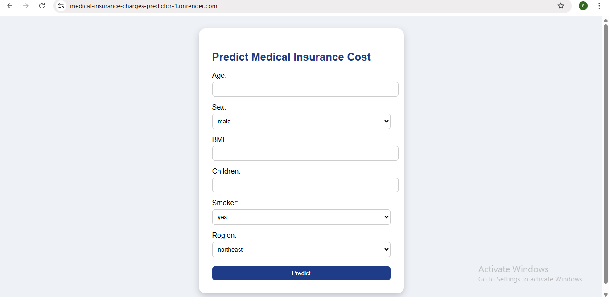
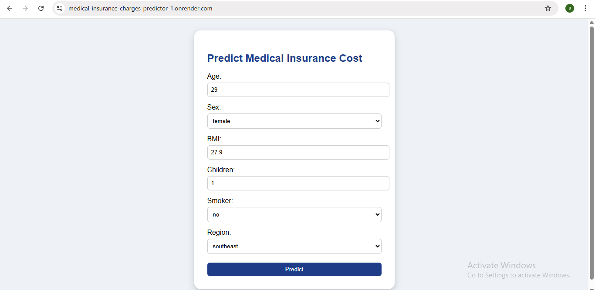
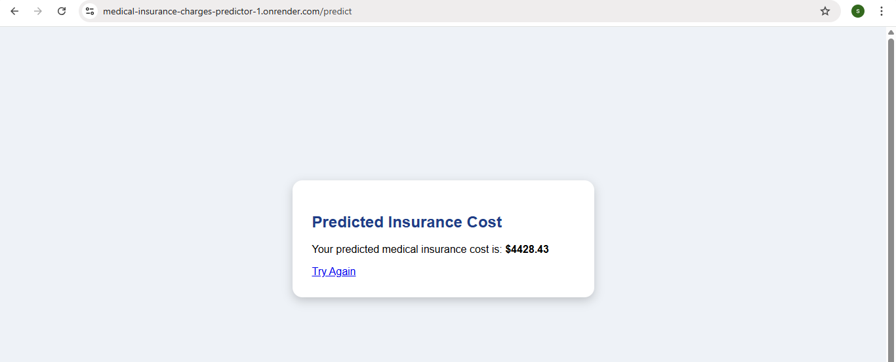

# medical-insurance-charges-predictor

This project is a web-based application that predicts house prices using **Ridge Regression**, trained on the Boston Housing dataset. The app is built with Python and Flask, and it takes housing-related inputs like number of rooms, tax rate, and crime index to estimate the median value of a house. It includes data preprocessing steps like imputation and scaling, and is deployed using Render for public access.

---

## Features

- Predicts Boston house prices using Ridge Regression for stable, regularized output.
- Accepts 13 housing-related inputs from users via a simple web form.
- Handles missing values with automatic mean imputation.
- Includes a clean, responsive Flask-based front end.
- Deployed on Render with support for live web access.

---

## Prerequisites

Make sure the following are installed:

- Python 3.7 or higher installed
- Git installed and configured
- Basic knowledge of Python and Flask
- A GitHub account (for code hosting)
- Render account (for deployment)

---

## Installation

### 1. Clone the repository

```
git clone https://github.com/sandhiya0147/medical-insurance-charges-predictor.git
cd medical-insurance-charges-predictor
```

### 2. Install dependencies

```
pip install -r requirements.txt
```

---

## Running the Application

Start the Flask development server:

```
python app.py
```

Then open your browser and go to:

```
http://127.0.0.1:5000
```

---

## How It Works

- The user fills out a web form with 13 housing features (like RM, TAX, CRIM, etc.).
- Flask collects the inputs and sends them to the backend for prediction.
- The model pipeline first imputes missing values and scales the input data.
- The trained Ridge Regression model makes a prediction based on the processed input.
- The app displays the predicted house price on a result page.
  
---

## File Structure

```
medical-insurance-charges-predictor
├── app.py
├── model_train.py
├── model.pkl
├── housing.csv
├── requirements.txt
├── Procfile
├── README.md
├── templates/
│   ├── home.html
│   └── result.html
├── static/
│   └── style.css       
```

---

## Future Improvements

- Add real-time data visualizations for feature impact and predictions.
- Include multiple regression models and let users compare outputs.
- Enable CSV upload for batch prediction of multiple houses.
- Improve the frontend using JavaScript and interactive charts.
- Integrate a database to log and review past user predictions.

---


## Step-by-Step Guide: How to Use the Movie Interest Predictor


### Step 1: Input Form
  

### Step 2: Filled Form 
  

### Step 3: Prediction Result


---

## Live Demo

[Click here to view the deployed app](https://medical-insurance-charges-predictor-1.onrender.com)

---
